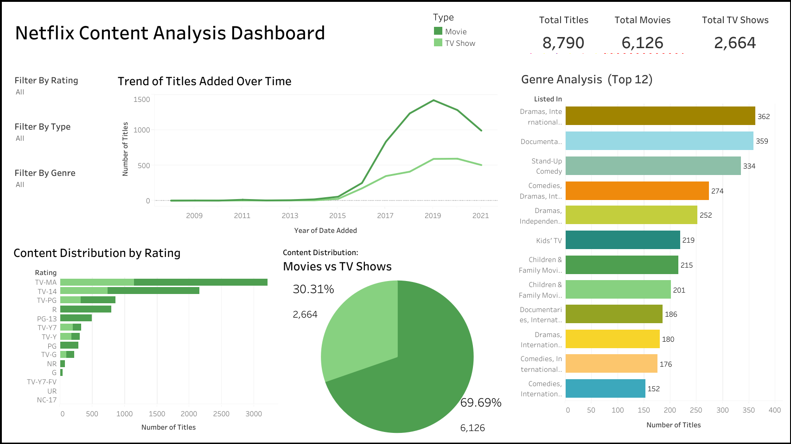

# Netflix Trends Data Analysis

This project analyzes Netflix content data to uncover trends in content type, ratings, genres, and time of release using **Python**, **Tableau**, and **Excel**.

---

## Dataset Overview

- Source: Netflix Titles Dataset (Kaggle)
- Rows: 8,790+ records
- Fields: Title, Type, Genre, Date Added, Country, Rating, Duration

---

## Tools & Technologies

| Tool       | Usage                             |
|------------|-----------------------------------|
| Python     | Data cleaning, EDA (`.ipynb` file)|
| Pandas, Matplotlib | EDA and visual analysis   |
| Excel      | Data checks and formatting        |
| Tableau    | Interactive dashboard creation    |

---

## Dashboard Insights

### Key Highlights:
- **Content Growth**: Massive spike in content added between 2016–2019  
- **Popular Genres**: Dramas, Documentaries, Comedy dominate top categories  
- **Type Split**: 69.7% Movies vs 30.3% TV Shows  
- **Top Ratings**: Most content rated TV-MA, TV-14  
- **Peak Year**: 2019 had the highest number of new additions

---

## File Structure

Netflix-Data-Analysis/  
│  
├── dashboard/  
│ ├── Dashboard.twb # Tableau workbook  
│ └── Dashboard.png # Dashboard image  
│  
├── data/  
│ ├── netflix_data.csv # Raw data  
│ └── netflix_data.xlsx # Cleaned or used in Tableau  
│  
├── notebooks/  
│ └── netflix_data_analysis.ipynb # EDA notebook  
│  
└── README.md  

---

## What I Learned

- Conducting deep EDA on media/entertainment datasets
- Identifying content trends using date-time analysis
- Visual storytelling using Tableau
- Structuring professional GitHub repos

---

*This project is part of my Data Analyst Portfolio.*
